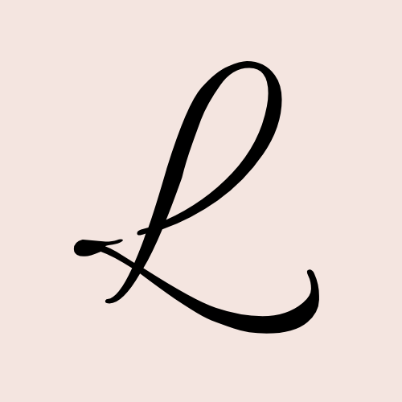

# Lyra Chic

  

## About
Lyra Chic is an interior, fashion, and graphic design agency website that prioritizes function and usability, thus making customers feel comfortable. 

Using the Lyra UI micro-framework, Lyra Chic delivers an elegant experience with consistent editorial serif design, a clear purpose, and a well-articulated layout. 

__DEMO__ > __https://lyraaurania.vercel.app__

## Key Features
1. Responsive design powered with Lyra UI
2. Smooth scrolling experience with custom parallax and Lenis.
3. Introducing PeopleCard and People Panel (side-panel view)
4. Build page: let you to explore our system in Web Design, music, and art.
5. 6 active members with their in-depth stories.
6. Lyra Themer.

## What is this foundation build? 
This website is build upon vanilla CSS and JavaScript (with ECMAScript 6 and TypeScript). In addition, we also compiled this website either to Vercel and GitHub Pages.

